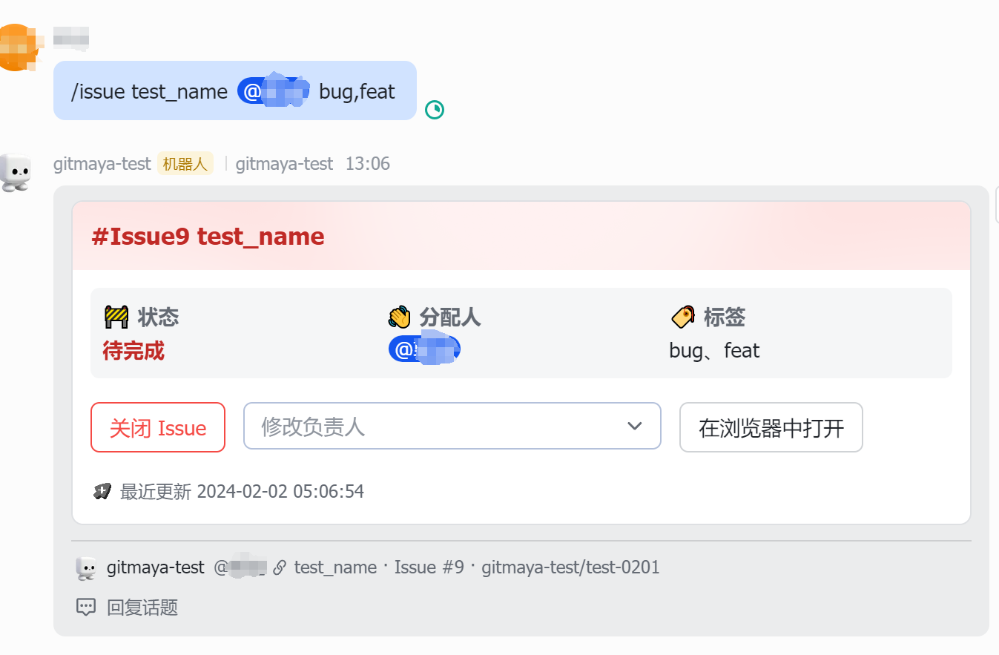
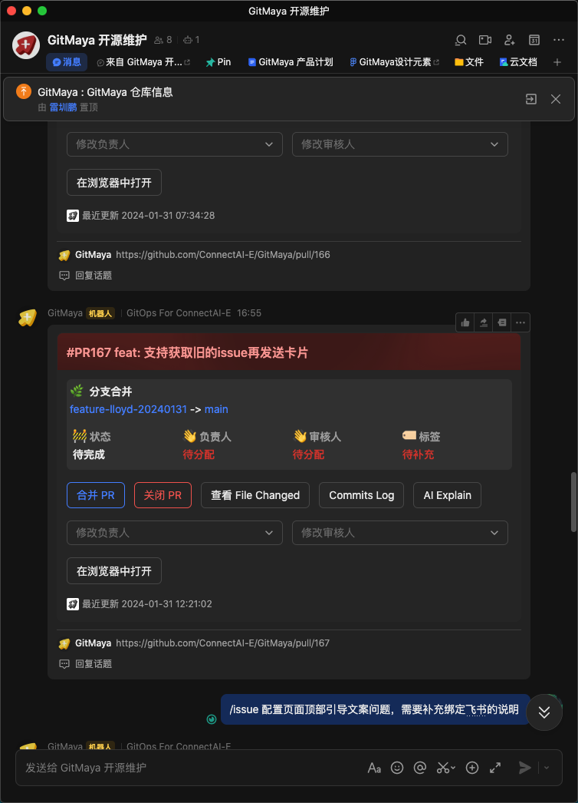
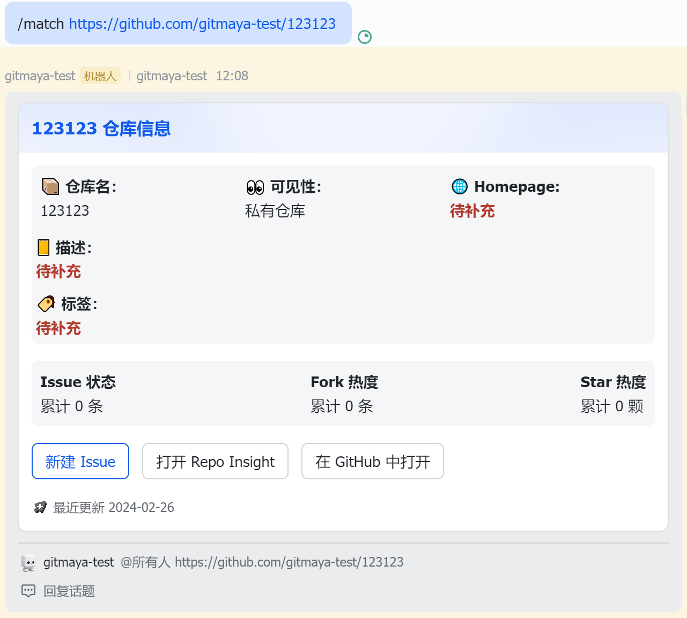

# 在飞书上使用 GitMaya

## 1. 用 GitMaya 打通飞书群组和 GitHub 代码仓库

通过 GitMaya 管理面板创建完成的飞书群组中会自动创建并置顶一个代码仓库信息卡片，通过代码仓库信息卡片可以直接在飞书中查看代码仓库相关信息，或者跳转至 GitHub 代码仓库页面


## 2. 查看 GitMaya 帮助

在飞书群组中，可以通过输入 `/help` 或者 `/man` 来查看 GitMaya 在群组中的操作说明


## 3. 在飞书中进行 Issue 协同

- 在飞书群组中，可以通过输入 `/issue` 来直接创建 issue，创建好的 Issue 会同步在对应的 GitHub 代码仓库中被创建，同时在飞书群组中会创建一个 Issue 信息卡片
  

- 创建 Issue 有两种方式
  - 不带描述 Issue ，可以直接从**群组中**或**回复消息**在**普通输入框**中创建：
    ```bash
    # 各个元素之间需要有空格
    # @多个负责人之间需要有空格，多个label用英文逗号连接
    /issue [Issue 标题](必须) @负责人(可选) label标签(可选)
    ```
    
    
  - 带描述 Issue 创建，需要从**群组中**的**展开输入框**创建：
    ```bash
    title: [Issue 标题](必须)
    body:
    # body 正文第一行固定以下格式
    /issue @负责人(可选) label标签(可选)
    # body 正文第二行开始就是 Issue 描述，无特定格式
    ...
    ```
    
    
  - Issue 信息卡片同时会创建一个飞书话题，直接回复话题可以将回复信息同步至 GitHub 代码仓库的 Issue Comment 中；同样的 GitHub Issue Comment 的新回复也会被同步至 Issue 信息卡片对应的飞书话题
    
  - **群聊绑定多仓库时，请在对应仓库话题下创建 Issue**

## 4. 在飞书中进行 PR 协同

- 当 GitHub 代码仓库中有新的 Pull Request，GitMaya 会在飞书群组自动创建对应的 PR 卡片；通过 PR 卡片可以直接跳转查看提交日志、文件变更等，也可以直接进行合并 PR 等操作
  

- 和 Issue Comment 类似，Pull Request 的 Conversation 记录也可以通过 PR 卡片对应的飞书群组进行同步
  

## 5. 在飞书群聊中关联多个仓库

- GitMaya 支持一个群聊同时关联多个仓库，在群聊回复`/match repo_url` 即可关联当前群聊
  
- 群聊关联多个仓库时，交互逻辑有所不同，**Issue 和 Pr 需要在对应的仓库话题中进行操作**
