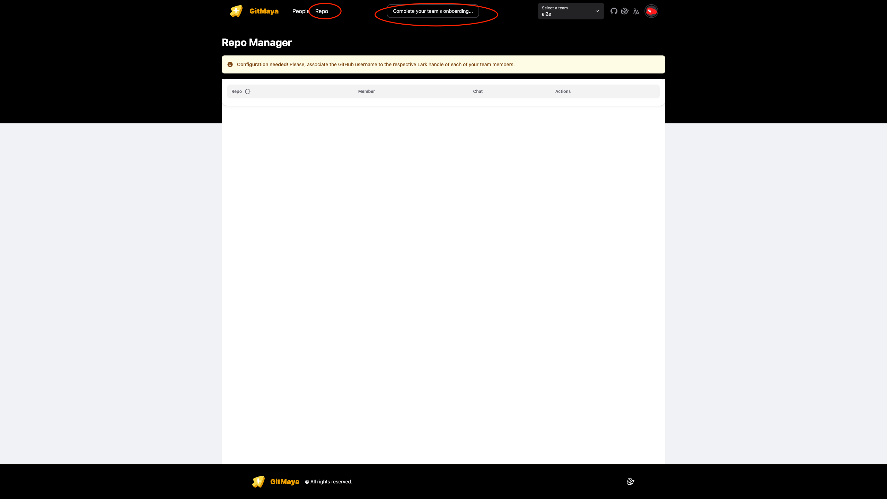
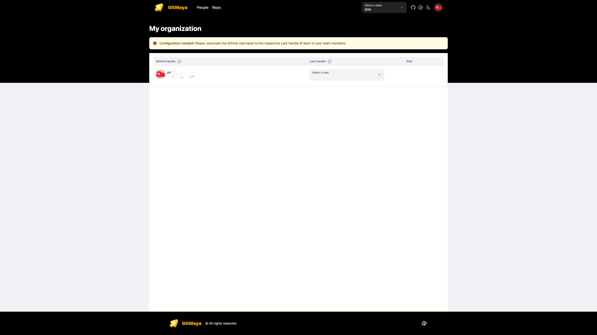
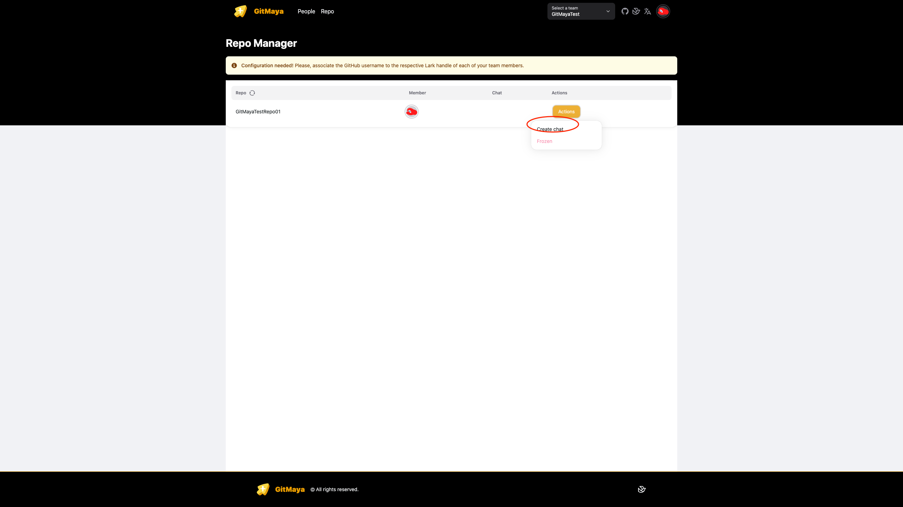
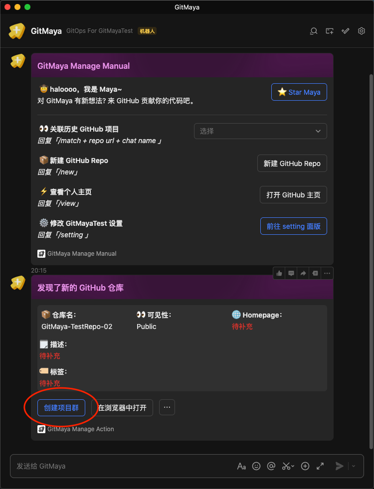
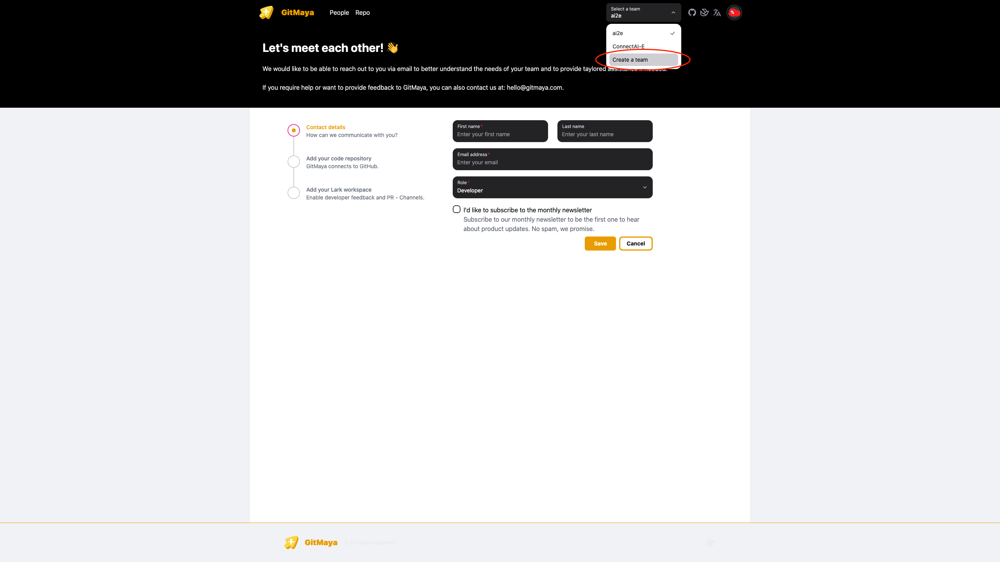

# 配置 GitMaya

## 1. 登录到 GitMaya 管理面板

当前支持直接使用 GitHub 账号进行登录

## 2. 安装 GitMaya App 到 GitHub

按照引导流程将 GitMaya App 安装 GitHub，实现 GitMaya 和 Github Organization 的打通

## 3. 完成 GitHub 和飞书绑定

### 3.1 通过提示引导进入绑定开始绑定飞书

### 3.2 或者点击顶部提示来开始绑定

### 3.3 点击绑定飞书

可以通过飞书一键部署或者手动部署飞书自建应用的方式来完成绑定 GitMaya 和飞书租户

### 3.4 绑定人员

进入 https://gitmaya.com/app/people 来绑定飞书内部成员和 GitHub 团队成员

## 4. 创建飞书群组

- 进入 https://gitmaya.com/app/repo 来创建飞书群组，对应的群组会和代码仓库关联
  

- 对于新创建的 GitHub 代码仓库，可以从飞书自建应用的机器人窗口中，通过新仓库消息卡片来创建飞书群组
  

- 同时支持通过 `/match` 指令来为已有代码仓库创建群组
  

## 5. 创建新团队

点击顶部「选择团队」>「创建团队」来创建新团队；按照引导可以绑定新的 GitHub Organization 和飞书租户

